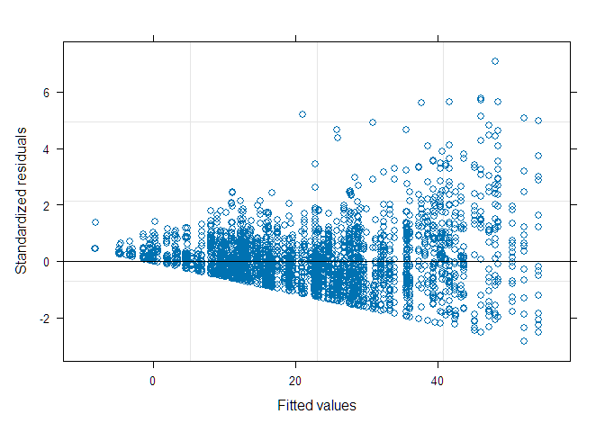

<!-- README.md is generated from README.Rmd. Please edit that file -->

## Análise de modelos mistos

### Carregando pacotes

``` r
library(tidyverse)
library(ggpubr)
library(rstatix)
library(nlme)
library(lme4)
```

### Preparando os dados

``` r
ds <- readxl::read_excel("data-raw/Prod_Alan.xlsx") |> 
  janitor::clean_names() 
write_rds(ds, "data/prod-laranja.rds")
```

### Lendo banco rds

``` r
data_set <- read_rds("data/prod-laranja.rds")
glimpse(data_set)
#> Rows: 3,158
#> Columns: 4
#> $ trat  <dbl> 1, 1, 1, 1, 1, 1, 1, 1, 1, 1, 1, 1, 1, 1, 1, 1, 1, 1, 1, 1, 1, 1…
#> $ safra <dbl> 2019, 2019, 2019, 2019, 2019, 2019, 2019, 2019, 2019, 2019, 2019…
#> $ rep   <dbl> 1, 2, 3, 4, 5, 6, 7, 8, 9, 10, 11, 12, 13, 14, 15, 16, 17, 18, 1…
#> $ prod  <dbl> 17.0, 23.3, 26.9, 8.2, 41.8, 0.0, 26.3, 5.4, 33.3, 22.5, 21.6, 1…
```

``` r
data_set$trat <- as.factor(data_set$trat)
data_set$safra <- as.factor(data_set$safra)
data_set$rep <- as.factor(data_set$rep)
```

``` r
modelo_cs <- lme(
  fixed = prod ~ safra,               # Efeito fixo do tempo (Safra)
  random = ~1 | trat/rep,             # Repetições aninhadas em Trat
  correlation = corCompSymm(form = ~1 | trat),  # estrutura CS para medidas repetidas por Trat
  data = data_set,
  na.action = na.exclude
)
modelo_cs
#> Linear mixed-effects model fit by REML
#>   Data: data_set 
#>   Log-restricted-likelihood: -13701.39
#>   Fixed: prod ~ safra 
#> (Intercept)   safra2020   safra2021   safra2022   safra2023   safra2024 
#>   18.176481   -9.259649  -12.824456   16.510278   18.634402    3.714290 
#> 
#> Random effects:
#>  Formula: ~1 | trat
#>         (Intercept)
#> StdDev:     8.85719
#> 
#>  Formula: ~1 | rep %in% trat
#>         (Intercept) Residual
#> StdDev:    3.455333 18.01176
#> 
#> Correlation Structure: Compound symmetry
#>  Formula: ~1 | trat/rep 
#>  Parameter estimate(s):
#>         Rho 
#> -0.03569737 
#> Number of Observations: 3158
#> Number of Groups: 
#>          trat rep %in% trat 
#>            25           760
```

``` r
modelo_ar1 <- update(modelo_cs, correlation = corAR1(form = ~ as.numeric(safra) | trat))
modelo_ar1
#> Linear mixed-effects model fit by REML
#>   Data: data_set 
#>   Log-restricted-likelihood: -13700.82
#>   Fixed: prod ~ safra 
#> (Intercept)   safra2020   safra2021   safra2022   safra2023   safra2024 
#>   18.176629   -9.311537  -12.824457   16.491020   18.584334    3.718371 
#> 
#> Random effects:
#>  Formula: ~1 | trat
#>         (Intercept)
#> StdDev:    8.803261
#> 
#>  Formula: ~1 | rep %in% trat
#>         (Intercept) Residual
#> StdDev: 0.003940596 18.34067
#> 
#> Correlation Structure: ARMA(1,0)
#>  Formula: ~as.numeric(safra) | trat/rep 
#>  Parameter estimate(s):
#>       Phi1 
#> 0.02117046 
#> Number of Observations: 3158
#> Number of Groups: 
#>          trat rep %in% trat 
#>            25           760
```

``` r
modelo_un  <- update(modelo_cs, correlation = corSymm(form = ~ as.numeric(safra) | trat))
modelo_un
#> Linear mixed-effects model fit by REML
#>   Data: data_set 
#>   Log-restricted-likelihood: -13479.71
#>   Fixed: prod ~ safra 
#> (Intercept)   safra2020   safra2021   safra2022   safra2023   safra2024 
#>   18.134987  -10.437735  -12.832151   16.547948   17.984447    3.868873 
#> 
#> Random effects:
#>  Formula: ~1 | trat
#>         (Intercept)
#> StdDev:    11.75476
#> 
#>  Formula: ~1 | rep %in% trat
#>         (Intercept) Residual
#> StdDev:    5.928743 20.33526
#> 
#> Correlation Structure: General
#>  Formula: ~as.numeric(safra) | trat/rep 
#>  Parameter estimate(s):
#>  Correlation: 
#>   1      2      3      4      5     
#> 2  0.750                            
#> 3  0.764  0.759                     
#> 4 -0.242 -0.258 -0.237              
#> 5 -0.152 -0.121 -0.154 -0.057       
#> 6  0.468  0.554  0.594 -0.196 -0.082
#> Number of Observations: 3158
#> Number of Groups: 
#>          trat rep %in% trat 
#>            25           760
```

``` r
# Comparação usando AIC e BIC
AIC(modelo_cs, modelo_ar1, modelo_un)
#>            df      AIC
#> modelo_cs  10 27422.79
#> modelo_ar1 10 27421.63
#> modelo_un  24 27007.42
BIC(modelo_cs, modelo_ar1, modelo_un)
#>            df      BIC
#> modelo_cs  10 27483.34
#> modelo_ar1 10 27482.19
#> modelo_un  24 27152.76
```

``` r
summary(modelo_cs)
#> Linear mixed-effects model fit by REML
#>   Data: data_set 
#>        AIC      BIC    logLik
#>   27422.79 27483.34 -13701.39
#> 
#> Random effects:
#>  Formula: ~1 | trat
#>         (Intercept)
#> StdDev:     8.85719
#> 
#>  Formula: ~1 | rep %in% trat
#>         (Intercept) Residual
#> StdDev:    3.455333 18.01176
#> 
#> Correlation Structure: Compound symmetry
#>  Formula: ~1 | trat/rep 
#>  Parameter estimate(s):
#>         Rho 
#> -0.03569737 
#> Fixed effects:  prod ~ safra 
#>                  Value Std.Error   DF    t-value p-value
#> (Intercept)  18.176481 1.8931795 2393   9.601034   0e+00
#> safra2020    -9.259649 1.3402096 2393  -6.909105   0e+00
#> safra2021   -12.824456 0.9440649 2393 -13.584295   0e+00
#> safra2022    16.510278 1.1345731 2393  14.551974   0e+00
#> safra2023    18.634402 1.2198209 2393  15.276342   0e+00
#> safra2024     3.714290 0.9747097 2393   3.810663   1e-04
#>  Correlation: 
#>           (Intr) sf2020 sf2021 sf2022 sf2023
#> safra2020 -0.176                            
#> safra2021 -0.249  0.352                     
#> safra2022 -0.207  0.293  0.416              
#> safra2023 -0.193  0.273  0.387  0.323       
#> safra2024 -0.241  0.341  0.484  0.404  0.378
#> 
#> Standardized Within-Group Residuals:
#>        Min         Q1        Med         Q3        Max 
#> -3.0172223 -0.5679466 -0.0347937  0.4289089  6.9244090 
#> 
#> Number of Observations: 3158
#> Number of Groups: 
#>          trat rep %in% trat 
#>            25           760
plot(modelo_cs, which = 1)  # Resíduos
```

<!-- -->

``` r
summary(modelo_ar1)
#> Linear mixed-effects model fit by REML
#>   Data: data_set 
#>        AIC      BIC    logLik
#>   27421.63 27482.19 -13700.82
#> 
#> Random effects:
#>  Formula: ~1 | trat
#>         (Intercept)
#> StdDev:    8.803261
#> 
#>  Formula: ~1 | rep %in% trat
#>         (Intercept) Residual
#> StdDev: 0.003940596 18.34067
#> 
#> Correlation Structure: ARMA(1,0)
#>  Formula: ~as.numeric(safra) | trat/rep 
#>  Parameter estimate(s):
#>       Phi1 
#> 0.02117046 
#> Fixed effects:  prod ~ safra 
#>                  Value Std.Error   DF    t-value p-value
#> (Intercept)  18.176629 1.8830975 2393   9.652516   0e+00
#> safra2020    -9.311537 1.3332294 2393  -6.984197   0e+00
#> safra2021   -12.824457 0.9443811 2393 -13.579747   0e+00
#> safra2022    16.491020 1.1349155 2393  14.530614   0e+00
#> safra2023    18.584334 1.2198724 2393  15.234654   0e+00
#> safra2024     3.718371 0.9752416 2393   3.812769   1e-04
#>  Correlation: 
#>           (Intr) sf2020 sf2021 sf2022 sf2023
#> safra2020 -0.174                            
#> safra2021 -0.251  0.354                     
#> safra2022 -0.209  0.289  0.425              
#> safra2023 -0.194  0.268  0.387  0.335       
#> safra2024 -0.243  0.336  0.484  0.404  0.387
#> 
#> Standardized Within-Group Residuals:
#>         Min          Q1         Med          Q3         Max 
#> -2.84175128 -0.57507446 -0.03265428  0.43632122  7.08169274 
#> 
#> Number of Observations: 3158
#> Number of Groups: 
#>          trat rep %in% trat 
#>            25           760
plot(modelo_ar1, which = 1)  # Resíduos
```

<!-- -->

``` r
summary(modelo_un)
#> Linear mixed-effects model fit by REML
#>   Data: data_set 
#>        AIC      BIC    logLik
#>   27007.42 27152.76 -13479.71
#> 
#> Random effects:
#>  Formula: ~1 | trat
#>         (Intercept)
#> StdDev:    11.75476
#> 
#>  Formula: ~1 | rep %in% trat
#>         (Intercept) Residual
#> StdDev:    5.928743 20.33526
#> 
#> Correlation Structure: General
#>  Formula: ~as.numeric(safra) | trat/rep 
#>  Parameter estimate(s):
#>  Correlation: 
#>   1      2      3      4      5     
#> 2  0.750                            
#> 3  0.764  0.759                     
#> 4 -0.242 -0.258 -0.237              
#> 5 -0.152 -0.121 -0.154 -0.057       
#> 6  0.468  0.554  0.594 -0.196 -0.082
#> Fixed effects:  prod ~ safra 
#>                  Value Std.Error   DF    t-value p-value
#> (Intercept)  18.134987 2.4740454 2393   7.330095       0
#> safra2020   -10.437735 0.8086520 2393 -12.907573       0
#> safra2021   -12.832151 0.5082508 2393 -25.247675       0
#> safra2022    16.547948 1.3705457 2393  12.073985       0
#> safra2023    17.984447 1.4375666 2393  12.510340       0
#> safra2024     3.868873 0.7934403 2393   4.876073       0
#>  Correlation: 
#>           (Intr) sf2020 sf2021 sf2022 sf2023
#> safra2020 -0.069                            
#> safra2021 -0.103  0.327                     
#> safra2022 -0.200  0.100  0.190              
#> safra2023 -0.177  0.143  0.176  0.376       
#> safra2024 -0.149  0.287  0.491  0.293  0.294
#> 
#> Standardized Within-Group Residuals:
#>         Min          Q1         Med          Q3         Max 
#> -2.87213461 -0.54586287 -0.02742603  0.45507796  5.81049234 
#> 
#> Number of Observations: 3158
#> Number of Groups: 
#>          trat rep %in% trat 
#>            25           760
plot(modelo_un, which = 1)  # Resíduos
```

<!-- -->

``` r
residuos <- residuals(modelo_cs, type = "pearson")
hist(residuos)
```

<!-- -->

``` r
shapiro.test(residuos)
#> 
#>  Shapiro-Wilk normality test
#> 
#> data:  residuos
#> W = 0.92387, p-value < 2.2e-16
```

``` r
residuos <- residuals(modelo_ar1, type = "pearson")
hist(residuos)
```

<!-- -->

``` r
shapiro.test(residuos)
#> 
#>  Shapiro-Wilk normality test
#> 
#> data:  residuos
#> W = 0.92266, p-value < 2.2e-16
```

``` r
residuos <- residuals(modelo_un, type = "pearson")
hist(residuos)
```

<!-- -->

``` r
shapiro.test(residuos)
#> 
#>  Shapiro-Wilk normality test
#> 
#> data:  residuos
#> W = 0.95249, p-value < 2.2e-16
```
